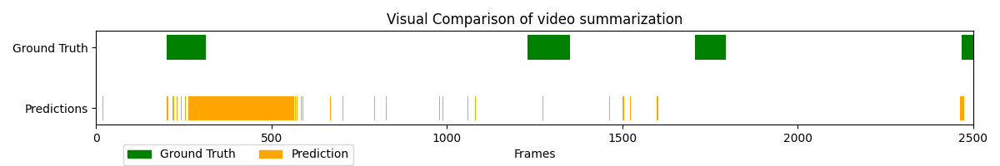
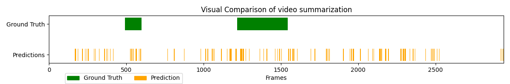

# Assignment 1: Video Summarization
- Course: Pattern Recognition (113/2) / National Taiwan Normal University

- Advisor: Chia-Hung Yeh

## Installation 
Download the repo
```bash
git clone https://github.com/mmlab8021/PR_113_Assignment1.git
cd PR_113_Assignment1
```

Install Python Environment
```bash
conda create -n pr python=3.8 -y
conda activate pr
```

Install required packages
```bash
pip install -r requirements.txt
```


## Re-production of baseline code
Download videos from slides and put them into the `videos` directory.

#### Video 1
```bash
python main.py --video ./videos/video1.mp4 --ground_truth ./labels/video1.json --save --output output_video1.mp4
```

 Method | F-Score | Precision | Recall 
:------ | ------- | --------- | -----:|
Baseline|  0.212  |   0.203   | 0.222 |



#### Video 2
```bash
python main.py --video ./videos/video2.mp4 --ground_truth ./labels/video2.json --rms 0.7 --hist 0.3 --save --output output_video2.mp4 --min_
segment_frames 10
```

 Method | F-Score | Precision | Recall 
:------ | ------- | --------- | -----:|
Baseline|  0.188  |   0.200   | 0.179 |



#### Video Youtube
```bash
python main.py --video ./videos/video_youtube.mp4 --save --output output_youtube.mp4 --min_segment_frames 15 --rms 0.7 --hist 0.3 --padding_seconds 1.0
```

## Acknowledgement
Thanks for data sharing.
[DSNet](https://github.com/li-plus/DSNet)

## Contact
Teaching Assistant: Wei-Cheng Lin(steven61413@gmail.com)
